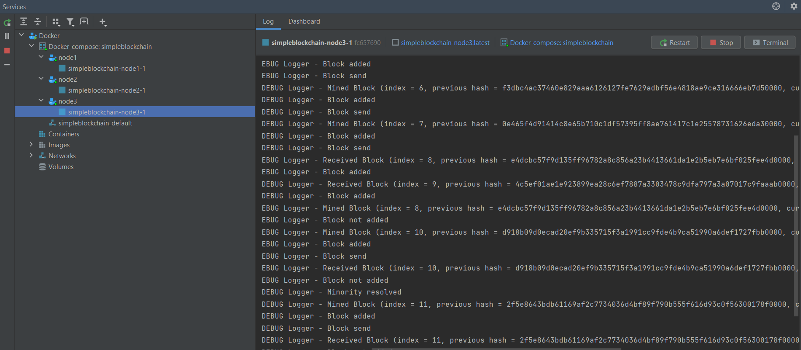

# SimpleBlockchain

Простой блокчейн на Kotlin с использованием Ktor.

Блокчейн состоит из:
- **Block** - класс блоков блокчейна, состоящий из:
    - **index** - номер блока. Номера возрастают по порядку с первого.
    - **previousHash** - хеш предыдущего блока.
    - **currentHash** - хеш текущего блока.
    - **data** - данные, строка длинной случайных 256 символов.
    - **nonce** - это дополнение, которое нужно будет сделать в блоке таким образом, чтобы выполнялось требование по хешированию.
- **Node** - класс текущего узла блокчейна.

Работа блокчейна осуществляется путём серверного взаимодействия между тремя нодами. Ноды генерируют блоки и пересылают их друг другу, так же реализован механизм отслеживания minority.

## Запуск проекта

Клонируем проект

```git clone https://github.com/Br0mm/SimpleBlockchain.git```

В папке с проектом собираем образ

```docker build -t simpleblockchain .```

Запускаем docker-compose

```docker-compose up```
## Результат

